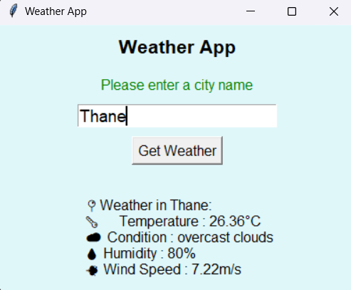

# 🌦 Weather App (Project 3) – 30 Python Projects Challenge

A simple yet functional **Weather Application** built with **Python**, **Tkinter**, and the **OpenWeatherMap API**.  
This app allows you to enter any city name and instantly fetch its current weather conditions.

---

## 📌 Features
- **GUI interface** built with Tkinter
- **Live weather data** from OpenWeatherMap API
- Displays:
  - 🌡 Temperature (°C)
  - 🌤 Condition
  - 💧 Humidity (%)
  - 💨 Wind speed (m/s)
- Input validation (asks for city if empty)

---

## 🛠 Tech Stack
- **Python** (Core language)
- **Tkinter** (GUI framework)
- **Requests** (API calls)
- **OpenWeatherMap API** (Weather data provider)

---

## 📂 Project Structure
03-Weather-App/
│── weather.py # Main Python script
│── README.md # Documentation file

## Dependencies 
pip install requests

## Get your OpenWeatherMap API key:
Sign up at OpenWeatherMap

Copy your API key

## Update the script:

In weather.py, replace:

API_KEY = "your_api_key_here"

## Screnshots
# Initial Screen
![alt text][def]
# After Fetching Weather

[def]: image.png

# Learning Outcomes
📚 Learning Outcomes
Understanding API requests & JSON parsing

Building Tkinter GUI applications

Handling user input validation

Integrating external APIs in Python projects

# License
This project is open source and available under the MIT License.